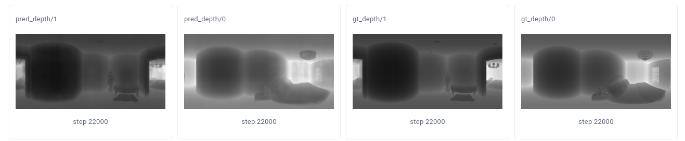

This repo contains the MultiViT implementation for Structured3D and Stanford2d3d dataset.

# How to start
```bash
nGPUs=$2
python -m torch.distributed.launch --nproc_per_node=$nGPUs --use_env main.py
```

# Generated Images

## Depth

